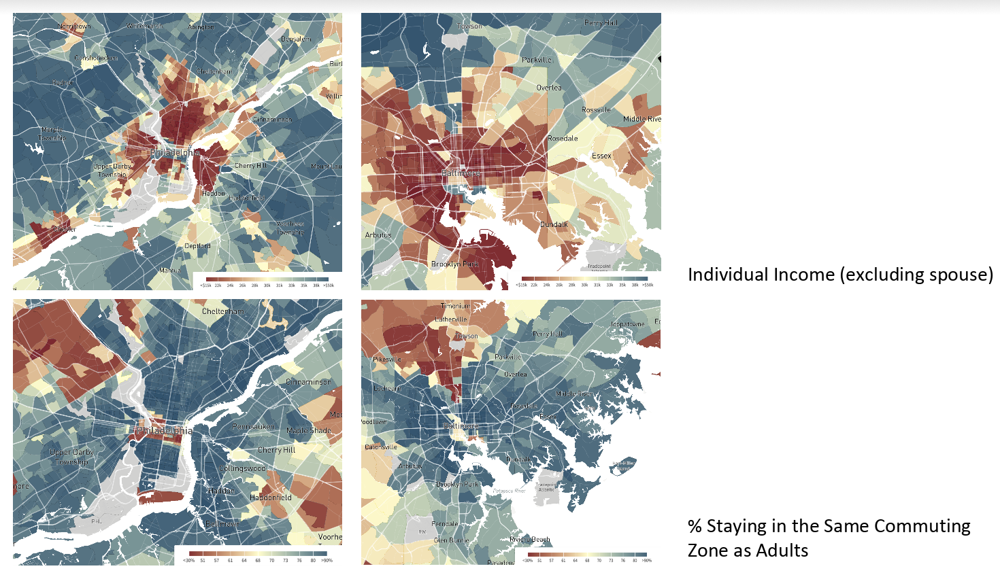
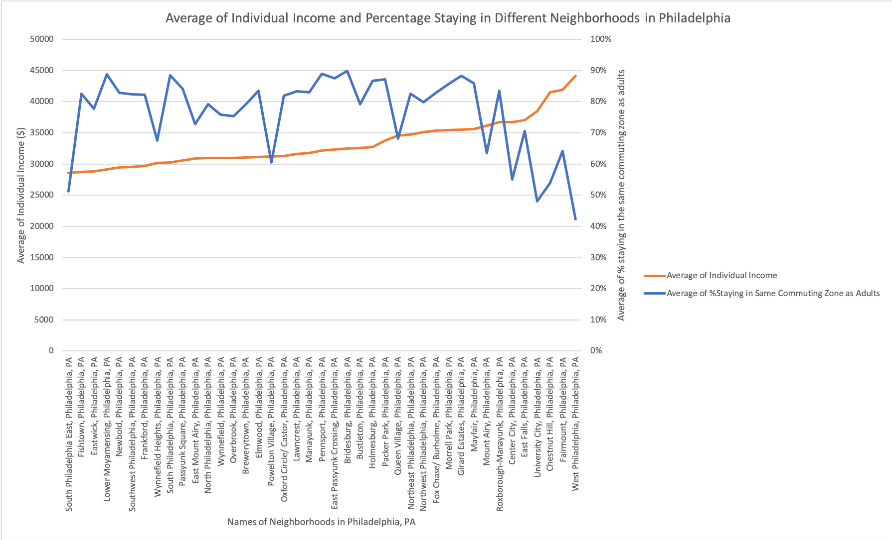
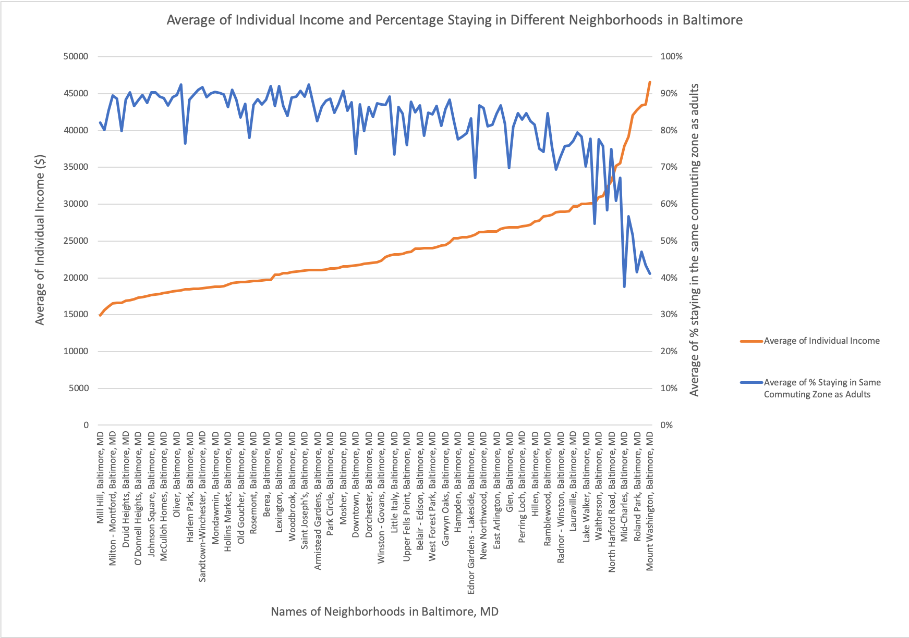

# 0214-Baltimore-vs.-Philadelphia-Commuting-Zones-and-Income_Sanny-YE

BRIEF DESCRIPTION

When looking at the Distribution of Individual Income in Baltimore, the well-known “butterfly” shape is shown in red, which indicates that individual income of people in those neighborhoods are below average. However, when looking at the percentage of people who still stay in the same commuting zone as they were in their childhood, we see the “butterfly” covered in green - an indication of a rather large proportion of people choosing to stay in the same neighborhood for decades. As we see a similar reversing trend in Philadelphia as well, I started wondering if there’s direct correlation between these two factors.

Examination of the correlation coefficients shows that a negative relationship exists between individual income of people living in different neighborhoods and the percentage of people who stay in the same commuting zone as adults in both Philadelphia and Baltimore. The more extreme nature of Baltimore’s datasets - lower in average income and higher in percentage staying - results in an even stronger correlation between the two factors.

In an article titled “Same City, Different Opportunities,” the author Cecilia Reyes states that kids from low-income families are not very likely to have opportunities to move to a better neighborhood, which means that they lack a chance to receive better education and to be immersed in a better environment in general. “When we say that a neighborhood has failed its children, … the underlying actors there are the political and the social institutions themselves,” Reyes concluded. There’s still a long way to go to achieve equal opportunities.

WEBSITE LINKS:

https://www.opportunityatlas.org; Reyes, Cecilia. "Same City, Different Opportunities." https://www.chicagotribune.com/investigations/ct-american-dream-for-chicago-analysis-htmlstory.html

STEP-BY-STEP PROCEDURE:

1. Extracting data from the Opportunity Atlas

a. Download data named “% Staying in Same Commuting Zone as Adults” (select “all” for
“parent income,” “child race,” and “child gender”) and “Individual Income (Excluding
Spouse)” in area around Baltimore and Philadelphia

b. Download data named “Individual Income” (select “all” for “parent income,” “child race,”
and “child gender”) in area around Baltimore and Philadelphia

2. Combining the four datasets as separate sheets in a new excel file

3. Sorting out irrelevant data

a. In the sheet named “Philly_stay,” find the city names included in column B. Commands used
for achieving this purpose are presented below:

i. =FIND(&quot;,&quot;,B2)” #find the first dash

ii. =FIND(&quot;,&quot;,$B2,I2+1) #find the second dash

iii. =MID($B2,I2+1,J2-1-I2) #find the LOOKUP value, which is the city names in
column B
or
iv. =MID($B2, FIND(&quot;,&quot;,$B2)+1, FIND(&quot;,&quot;,$B2,FIND(&quot;,&quot;,$B2)+1) -1 -
FIND(&quot;,&quot;,$B2)) #combining the previous commands

b. Press “shift” “control” and “return” to make sure that the formula is entered as an array
formula for all rows in column L

c. Click “Data” and select “Filter” to delete rows that not contain the word “Philadelphia” in
order to ensure all data are relevant

d. Repeat the same steps in the other three sheets (delete columns that do not include
“Baltimore” as city names in sheets named “bmore_stay” and “bmore_income” instead)

4. Organizing data relevant to Baltimore and Philadelphia contained in the four worksheets
a. Combine “bmore_income” and “bmore_stay” according to their shared track number using
the VLOOKUP formula:

i. =VLOOKUP(A2,bmore_income!$A$2:$C$324,3,FALSE)

b. Combine “philly_income” and “philly_stay” according to their shared track number using the
VLOOKUP formula:

i. =VLOOKUP(A2,bmore_income!$A$2:$C$324,3,FALSE)

ii. Since some of the neighborhoods lack records of individual income, we are not going
to consider these neighborhoods in this particular case. Therefore, click “data” and
select “filter” to filter out rows where there’s no data on individual income

5. Generating final dataset used for analysis by creating new worksheets called “Philadelphia” and
“Baltimore”
a. Calculate mean% and mean individual income using the “average” formula

6. Creating PivotTables for each worksheet

a. Put “Names of Neighborhoods in Philadelphia/Baltimore” in rows and “average of %
Staying in the Same Commuting Zone as Adults (%)” and “Average of Individual
Income ($)” as values

b. Sort individual income in the two worksheets from small to large

c. Create PivotCharts (2-D line with primary and secondary vertical axis) and label the axis

7. Analyzing data

a. Using the “correl” formula to calculate the correlation coefficient to determine the
relationship between percentage of population staying in the same commuting zone as
adults across neighborhoods in Philadelphia and Baltimore and people’s average
individual incomes in those neighborhoods

8. Generating results:

a. Although the average individual income (excluding spouse) across neighborhoods in
Philadelphia (~$33,887) is higher than Baltimore (~$23,667), there is on average a
relatively lower proportion of people staying in the same commuting zone where they
grew up in Philadelphia (76%) than in Baltimore (82%).

b. Since the absolute value of the correlation coefficient (-0.51) is greater than 0.5 but less
than 0.7, there is a moderate relationship between the two sets of data - the individual
income of people living in different neighborhoods in Philadelphia and the percentage of
people who stay in the same commuting zone as adults. 

c. Since the correlation coefficient
(-0.86) is negative and the absolute value of the correlation coefficient is greater than 0.8,
there is a strong negative relationship between the two sets of data - the individual
income of people living in different neighborhoods in Baltimore and the percentage of
people who stay in same commuting zone as adults.

CONCLUSION

Examination of the correlation coefficients shows that there is a negative relationship between individual income of people living in different neighborhoods and the percentage of people who stay in the same commuting zone as adults in both Philadelphia and Baltimore.
